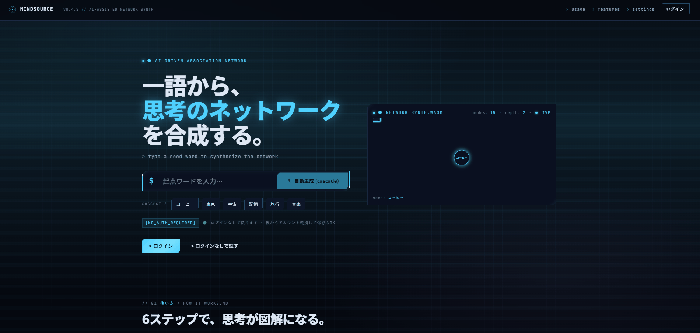
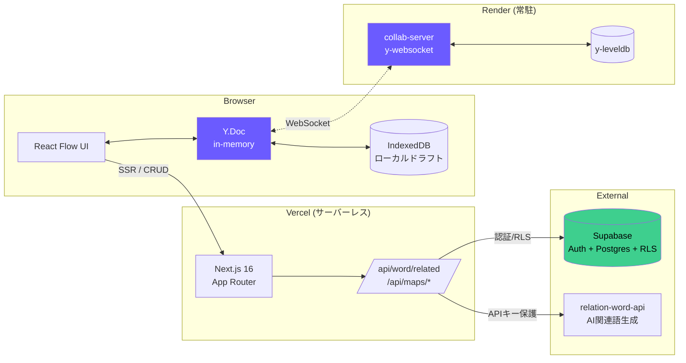
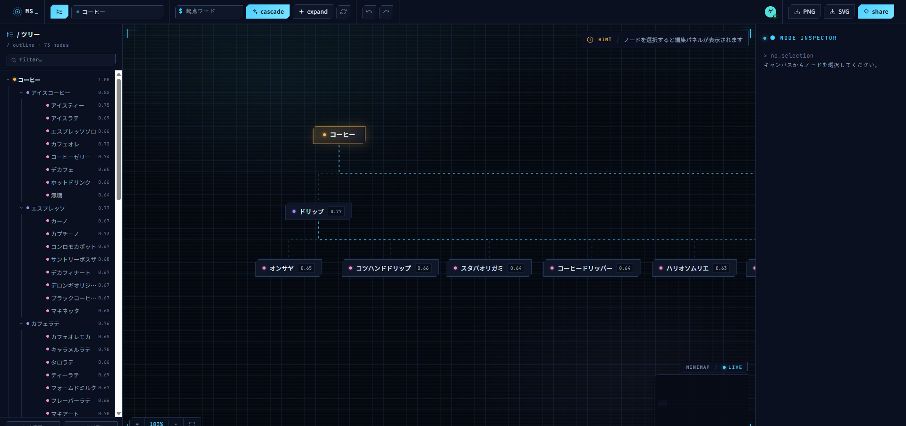
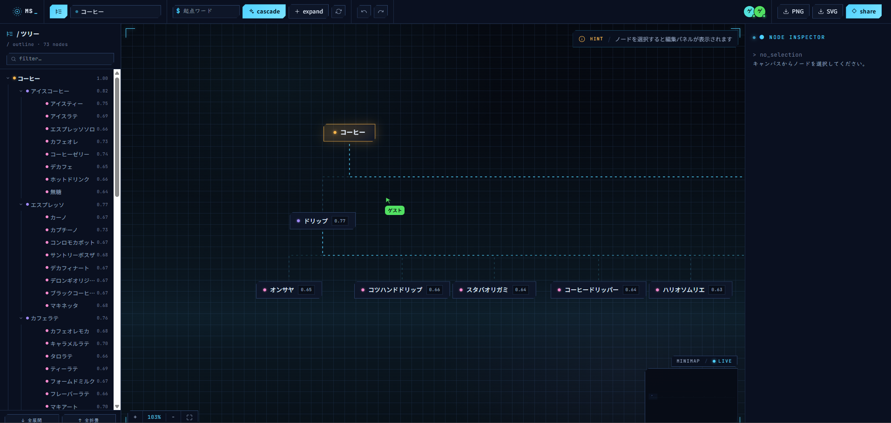

<div align="center">
    
# MindSource

**思考を、みんなで広げる。** — リアルタイム共同編集 × AI 関連語展開のマインドマップ


<!-- TODO: デモGIF差し替え -->


**[🔗 ライブデモを開く](https://mindsource.vercel.app/)** ・ [使い方を見る](#主要機能) ・ [セットアップ](#セットアップ)

</div>

---
## 設計思想
### なぜ作ったのか
マインドマップを作るアプリは存在しますが、以下の要件を満たすアプリは有りませんでした。

1. **複数人が同時に書き込める**(会議中にメンバー全員でノードを足せる)
2. **AI が関連語を提案してくれる**(発想の "次の一手" が出てこない時間を潰したい)
3. **ログインせずに試せる**(初見のハードルを極限まで下げたい)

MindSource はこの 3 点を 1 つのアプリに収める試みです。

### 必須要件
以下の要件をこちらから提示し、技術的なアプローチや領域が分からない部分はAIを用いて補填してもらった。
- UXに長け、手動でもマインドマップを編集しやすい形にする。
- 与えたキーワードからマインドマップを自動生成する（[自作API](https://github.com/KuwadaKouhei/relation-word-api)を使う）
- フロントエンドはReact + Next.js + TypeScriptで構成する（自分の知見を深めたい為）
- デプロイ先はVercelとする（無料枠が豊富でNext.jsとも相性が良くポートフォリオとして最適だと判断）
---

## 技術的アプローチ ★最重要

### 1. CRDT によるサーバーレス競合解決 

ノード追加・位置変更・文字編集は **すべて Yjs(CRDT)** で同期します。サーバー側に競合解決ロジックを一切書かないため、collab-server は「更新を受け取って他クライアントに配るだけ」の薄い層に保てます。

```ts
// src/lib/yjs/doc.ts — 構造を3つのY.Mapに分離
const yNodes = ydoc.getMap<YNodeValue>("nodes");
const yEdges = ydoc.getMap<YEdgeValue>("edges");
const yMeta  = ydoc.getMap<YMetaValue>("meta");
```

`Y.UndoManager` で **ローカル編集だけを Undo 対象にする** ことで、他人の編集を自分の Undo で巻き戻す事故を防いでいます([src/hooks/useMindmap.ts](src/hooks/useMindmap.ts#L41-L47))。

### 2. 分散構成:サーバーレス × 常駐 WS のハイブリッド　

Next.js(Vercel)はサーバーレスなため、WebSocket の長寿命接続には向きません。そこで **collab-server だけを Render の常駐プロセス** に切り出しました([collab-server/src/index.ts](collab-server/src/index.ts))。

- フロント / 認証 / CRUD API:**Vercel サーバーレス**
- 共同編集 WebSocket:**Render 常駐**
- 関連語 AI API:**別サービス**(キー漏洩防止のため Next.js API Route 経由で呼び出し)

この分離により、常駐が必要な部分だけにコストを払う構成になっています。

### 3. 二層永続化:IndexedDB + Supabase + y-leveldb　

同じドキュメントを、用途ごとに 3 つの永続化レイヤに落とします。

- **ログイン前**:IndexedDB(`idb-keyval`)にローカルドラフトとして保存
- **ログイン後の権威データ**:Supabase Postgres にスナップショット保存
- **リアルタイム差分**:collab-server の y-leveldb に逐次書き込み

ログイン前に作ったマップをログイン後にインポートできるフローも、ここを軸に組まれています([src/app/api/maps/import/route.ts](src/app/api/maps/import/route.ts))。

---

## アーキテクチャ図



---

## 主要機能

<table>
<tr>
<td width="50%">

### 🧠 AI 関連語展開
ノードを選んで "展開" を押すと、AI が関連語を枝として自動生成します。
<br/>

</td>
<td width="50%">

### 👥 リアルタイム共同編集
他ユーザーのカーソル・選択状態が見え、編集は即時反映されます。
<br/>

</td>
</tr>

</table>

<!-- TODO: スクショ差し替え -->

---

## 仕組み

> **CRDT(Yjs)でサーバーロジックを最小化し、Supabase RLS で権限を宣言的に扱い、Next.js 16 で UI / BFF を 1 箇所に、WS 常駐が必要な collab-server だけを別サービスとして切り出す。**

### データフローの要点

1. **編集はまずローカル Y.Doc に当たる**
   クライアントの `Y.Doc` が真の編集対象。UI は `Y.Doc` のスナップショットを React state に写しているだけ。

2. **差分は即座に WS でブロードキャスト**
   `y-websocket` は差分更新を他クライアントに配信し、collab-server 側の `y-leveldb` にも同時に書く。

3. **スナップショットはサーバーレス側で保存**
   一定間隔 or 明示保存で、Next.js API(`/api/maps/[id]/snapshot`)が Supabase に権威スナップショットを書き込む。

4. **権限は RLS で守る**
   Next.js API はユーザー cookie を Supabase に渡すだけ。「そのマップを見てよいか / 書き換えてよいか」の判定は Postgres の RLS ポリシーが担当。

5. **AI 関連語は必ずサーバー経由**
   `/api/word/related` がブラウザから relation-word-api へ直接叩かせないためのプロキシ。キーは `RELATION_WORD_API_KEY` としてサーバー側のみに置く。

### Origin チェックで WS を保護

collab-server は `CLIENT_ORIGIN` 環境変数で許可 Origin を絞り、それ以外からの upgrade は 403 で拒否します([collab-server/src/index.ts](collab-server/src/index.ts#L46-L53))。

---

## セットアップ

<details>
<summary><b>必要なもの</b></summary>

- Node.js 20+
- Supabase プロジェクト(無料枠で OK)
- relation-word-api(別リポジトリ。ローカルは `http://localhost:8000` で起動)

</details>

<details>
<summary><b>1. 環境変数</b></summary>

`.env.example` をコピーして `.env.local` を作成します。

```bash
cp .env.example .env.local
```

```env
# Supabase
NEXT_PUBLIC_SUPABASE_URL=https://YOUR_PROJECT.supabase.co
NEXT_PUBLIC_SUPABASE_ANON_KEY=your-anon-key

# relation-word-api (server-side only)
RELATION_WORD_API_BASE_URL=http://localhost:8000
RELATION_WORD_API_KEY=dev-key-1

# Collab websocket (public)
NEXT_PUBLIC_COLLAB_WS_URL=ws://localhost:1234
```

</details>

<details>
<summary><b>2. Supabase スキーマ</b></summary>

`supabase/migrations/` 配下の SQL を Supabase プロジェクトに適用してください。主要テーブル:

- `mindmaps` — マップのメタ情報とスナップショット
- `map_collaborators` — 共同編集者
- `profiles` — ユーザープロフィール

各テーブルに RLS ポリシーが定義されています。

</details>

<details>
<summary><b>3. インストールと起動</b></summary>

```bash
# 依存インストール
npm install
npm install --prefix collab-server

# Next.js と collab-server を同時起動
npm run dev:collab
```

- Next.js: http://localhost:3000
- collab-server: ws://localhost:1234

Next.js だけ起動したい場合は `npm run dev`。

</details>

---

## ディレクトリ構成

<details>
<summary><b>クリックで展開</b></summary>

```
mindsource/
├── src/
│   ├── app/                      # Next.js App Router
│   │   ├── (auth)/               # 認証系ページ
│   │   ├── api/                  # BFF: maps / word / settings / profile
│   │   ├── maps/[id]/            # 編集画面 (ログイン済み)
│   │   ├── maps/local/[localId]/ # 編集画面 (ローカルドラフト)
│   │   └── me/, settings/        # ユーザー系ページ
│   ├── components/
│   │   ├── editor/               # Canvas / Toolbar / PresenceBar など
│   │   ├── flow/                 # WordNode / ColorScheme
│   │   ├── home/                 # ランディングページ
│   │   ├── layout/               # LayoutRunner (ELK + radial)
│   │   ├── me/, settings/        # ユーザー設定 UI
│   │   └── ui/primitives/        # Button / Tag / Logo などの基礎 UI
│   ├── hooks/                    # useMindmap / useSettings / useAutoGen
│   └── lib/
│       ├── yjs/                  # Y.Doc 生成・binding・provider
│       ├── supabase/             # server / client 用 Supabase クライアント
│       ├── relation-word-api/    # AI API クライアント (server/client)
│       ├── storage/localDraft.ts # IndexedDB ドラフト
│       ├── flow/                 # React Flow 変換 + 配色
│       └── settings/             # zod スキーマとデフォルト値
├── collab-server/                # y-websocket + y-leveldb 常駐サーバー
│   └── src/index.ts
├── docs/                         # ドキュメント
│   ├── tech-stack-rationale.md
│   └── verification-scenarios.md # 動作確認シナリオ
└── .env.example
```

</details>

---

## 動作確認シナリオ

詳細は [docs/verification-scenarios.md](docs/verification-scenarios.md) を参照してください。カバーしているシナリオ:

- 単独ユーザーでのノード追加・編集・Undo/Redo
- 2 ブラウザでの同時編集・カーソル表示
- ログイン前ドラフト作成 → ログイン後インポート
- AI 関連語展開と中断
- 権限外ユーザーの閲覧 / 編集拒否(RLS)
- collab-server 再接続(WS 切断からの復帰)

---

## 未着手部分・と理由

正直に書きます。以下は認識しているが **意図的に未着手** の論点です。

- **同時編集ユーザー上限は 10 名程度まで** ─ それ以上は awareness の帯域と React Flow の再レンダで劣化します。shard 化は未検討。
- **画像ノード未対応** ─ 現状はテキストノードのみ。Blob ストレージの導入が前提条件。
- **オフライン編集の自動マージは部分的** ─ Yjs 的にはマージされますが、UX として「オフラインで書いたものが戻ってくる感」の作り込みは未完。
- **モバイル最適化は最低限** ─ タッチでのノード作成・ピンチズームは動くが、UI 密度はデスクトップ優先。
- **AI レスポンスのストリーミング未対応** ─ 関連語は一括返却。将来的には SSE 化予定。
- **collab-server の水平スケール未対応** ─ y-leveldb がファイルシステム依存のため、複数インスタンスで同一ルームを扱えません。Redis 版への差し替えが必要。
- - **ノード自動生成時の円状表示** ─ ノード自動生成時や自動成型時に円状に表示する機能の未対応。ノードの大きさや数によって変化するため、学習目的の今回とは意図がズレる為アルゴリズム未実装

---

## 作者情報

**Kouhei Kuwada**

- GitHub: [@KuwadaKouhei](https://github.com/KuwadaKouhei)
- Email: kuwada.k3205@gmail.com

技術的な質問・採用に関する連絡は歓迎します。Issue でも OK です。

---

## ライセンス

[MIT License](./LICENSE) © 2026 Kouhei Kuwada
